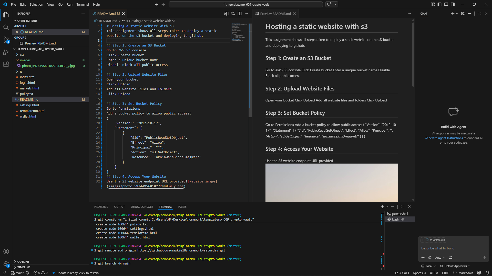

# Hosting a static website with s3
This assignment shows all steps taken to deploy a static website on the s3 bucket and deploying to github.

## Step 1: Create an S3 Bucket
- Go to AWS S3 console
- Click Create bucket
- Enter a unique bucket name
- Disable Block all public access

## Step 2: Upload Website Files
- Open your bucket
- Click Upload
- Add all website files and folders
- Click Upload

## Step 3: Set Bucket Policy
- Go to Permissions
- Add a bucket policy to allow public access:
{
    "Version": "2012-10-17",
    "Statement": [
        {
            "Sid": "PublicReadGetObject",
            "Effect": "Allow",
            "Principal": "*",
            "Action": "s3:GetObject",
            "Resource": "arn:aws:s3:::s3magmt/*"
        }
    ]
}
## Step 4: Access Your Website
- Use the S3 website endpoint URL provided